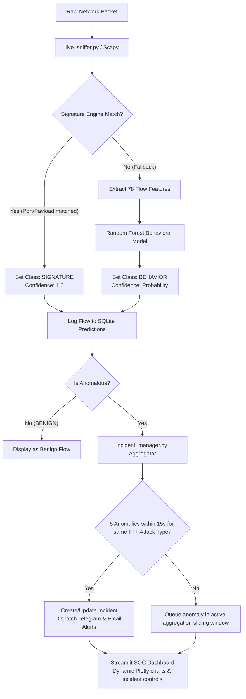

# Project Documentation: KryptaFlow NIDS (Network Intrusion Detection System)

**KryptaFlow NIDS** is an intelligent, real-time, hybrid Network Intrusion Detection System. It captures live network traffic, matches connections against signature rules (Port/Payload), falls back to a Random Forest machine learning model for behavioral anomaly detection, aggregates anomalies into high-level incidents to prevent alert fatigue, and visualizes everything on a premium glassmorphic Streamlit SOC dashboard with integrated Telegram/Email alerting.

---

## 1. Abstract
As modern network attacks evolve, relying solely on signature-based firewalls fails to catch zero-day threats, while relying solely on machine learning causes high computational overhead and false positives. This project presents **KryptaFlow NIDS**, a hybrid system combining the speed of signature-based matching with the intelligence of machine learning behavioral analysis.

The system sniffs raw TCP/UDP packets, checks them against known signature patterns (ports/payloads), and falls back to a Random Forest classifier (trained on the CICIDS2017 dataset) for deep behavioral inspection. Classified anomalies are routed to a sliding 15-second aggregation window that groups anomalies by Source IP and Attack Type into singular "Incidents," firing a single urgent alert once 5 anomalies are triggered rather than spamming administrators for every anomalous flow. The entire system logs directly to a high-concurrency SQLite database (configured in WAL mode) and renders live statistics on an authenticated Streamlit SOC dashboard.

---

## 2. Problem Statement
Traditional network security infrastructures suffer from several critical weaknesses:
1.  **Inefficacy Against Zero-Day Attacks**: Signature-based systems cannot block threats that do not have a pre-registered hash or rule.
2.  **ML Performance Overhead**: Running high-dimensional feature extraction and ML inference on *every* single packet is computationally expensive.
3.  **Alert Fatigue**: Under attack, an intruder can trigger thousands of individual alarms in seconds, overwhelming security operators (spamming channels).
4.  **Operational Disconnection**: Security teams lack a unified, real-time visual dashboard indicating the threat state, attacker sources, and incident status in one clean interface.

---

## 3. Technology Stack

| Layer | Component | Technology |
|---|---|---|
| **View & Controller** | SOC Dashboard UI | Streamlit (Python) |
| | Visualizations | Plotly (Active Incident feeds, Threat Breakdown Doughnut, Attacker IP Charts) |
| | Styling | Custom CSS3 (Dark Glassmorphic SOC Theme) |
| | Threat Alerting | SMTP (Secure HTML Email) & Telegram Bot API |
| **Model** | Machine Learning | Scikit-Learn, Joblib, Pandas, NumPy |
| | Database | SQLite (WAL mode enabled for concurrent read/write transactions) |
| **Ingestion** | Sniffer Engine | Scapy (Packet sniffing & 5-tuple flow aggregation) |
| | Signature Engine | Port-based and Regex Payload matching rules (`signatures.json`) |
| | Aggregator | Sliding-window database incident manager (`incident_manager.py`) |

---

## 4. System Architecture

To maintain a clean and lightweight Streamlit-native lifecycle, the project uses a flat directory architecture where ingestion, detection, database handling, and UI rendering are decoupled:

```
IDS_Project/
│
├── signatures.json             ← Rules for port-based & payload-based regex matches
├── signature_engine.py         ← Runs port scans & raw packet payload checks
├── ml_model.py                 ← Loads RandomForest assets & runs predict_single() fallback
├── incident_manager.py         ← Aggregates anomalies (15s window, threshold=5) into Incidents
├── database.py                 ← Handles SQLite WAL config, incident updates & metrics logging
├── severity_engine.py          ← Computes dynamic overall system threat levels
├── user_model.py               ← Manages operator authentication (bcrypt passwords)
├── notification_engine.py      ← SMTP and Telegram alerting with incident summaries
├── alert_engine.py             ← Colorized CLI logging utilities
├── logger.py                   ← Structured JSON logging format
├── dashboard.py                ← Streamlit SOC Dashboard application
├── live_sniffer.py             ← Scapy packet capture agent (sniffs live interfaces)
├── simulator.py                ← High-fidelity simulator for testing alerts & signatures
└── schema.sql                  ← Database schema (predictions, incidents, and users tables)
```

---

## 5. End-to-End Workflow



1.  **Ingestion & Capture**: `live_sniffer.py` uses Scapy to capture packets and groups them into bidirectional 5-tuple flows.
2.  **Signature Match (First Pass)**: Checks if the packet contains insecure port requests (FTP, Telnet) or contains attack strings in the payload (SQLi like `union select`, Path Traversal like `../`). If matched, it bypasses ML to reduce computational latency.
3.  **Behavioral Fallback (Second Pass)**: If no signatures match, it extracts 78 statistical characteristics (packet inter-arrival times, flag counts, packet size variances) and runs them through the Random Forest classifier (`ids_model.pkl`).
4.  **Logging**: Flows are persisted immediately into the SQLite database.
5.  **Alert Aggregation**: Anomalies are processed by the Incident Manager. Instead of sending alerts for every single flow, it aggregates them by Source IP and Attack Type inside a sliding 15-second window. Once 5 anomalies are detected, a single incident is registered, and an urgent Telegram/Email summary is sent.
6.  **SOC Dashboard Rendering**: Security operators authenticate and monitor a live visual feed. Charts show active incidents, top attacking IPs, and detection method percentages.

---

## 6. How to Run Locally

### Step 1: Install Python Dependencies
```bash
pip install -r requirements.txt
```

### Step 2: Start the Streamlit SOC Dashboard
```bash
npm run dev
```
The dashboard will launch on `http://localhost:8501`. You can register an account or log in.

### Step 3: Run the Ingestion Agent

You have two choices to feed traffic into the SOC dashboard:

#### Option A: Live Network Sniffer (Requires Administrator/root privileges)
To capture real-world traffic on your network card, run a command prompt/terminal as **Administrator/root** and execute:
```bash
python live_sniffer.py
```
*(Make sure Npcap is installed if running on Windows).*

#### Option B: Traffic Simulator (Direct SQLite Logging, No Admin Required)
If you don't have Administrator rights or Npcap installed, use the simulator to generate synthetic attacks and benign traffic:
```bash
python simulator.py --speed 1
```

Both agents run ML predictions locally in-memory and write results directly to `logs/ids_predictions.db`. The Streamlit dashboard will detect the activity and automatically display **ONLINE** status.

---

## 7. Render Cloud Deployment

*   **Render Web Service**: Connect your GitHub repository to Render. Render will read the `render.yaml` blueprint at the root and deploy the Streamlit application as a Web Service.
*   **Zero-Config Blueprint**: The service builds dependencies via `requirements.txt` and starts the app with:
    ```bash
    streamlit run dashboard.py --server.port $PORT --server.address 0.0.0.0
    ```
*   **Database Considerations**: SQLite database files on Render's free tier are ephemeral and local to the web instance container. To run predictions and visualize them, you can utilize the Streamlit UI directly.
